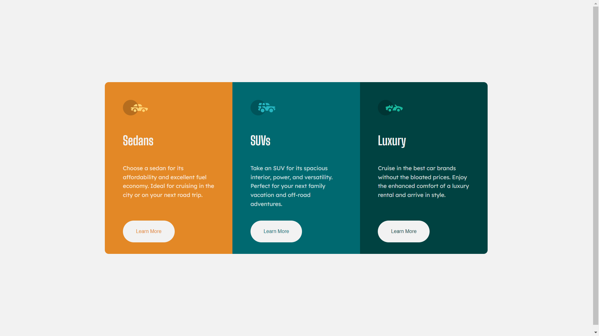

# Frontend Mentor - 3-column preview card component solution

This is a solution to the [3-column preview card component challenge on Frontend Mentor](https://www.frontendmentor.io/challenges/3column-preview-card-component-pH92eAR2-). Frontend Mentor challenges help you improve your coding skills by building realistic projects.

## Table of contents

- [Overview](#overview)
  - [The challenge](#the-challenge)
  - [Screenshot](#screenshot)
  - [Links](#links)
- [My process](#my-process)
  - [Built with](#built-with)
  - [Useful resources](#useful-resources)
- [Author](#author)
- [Acknowledgments](#acknowledgments)

## Overview

The challenge is design three card.

### The challenge

This challenge is very good to learn diffrent layout and I learned media query in css.

- View the optimal layout depending on their device's screen size
- See hover states for interactive elements

### Screenshot

### Links

- Solution URL:(https://github.com/VikashMaurya10/3-column-preview-card-component-main)
- Live Site URL: (https://vikashmaurya10.github.io/3-column-preview-card-component-main/)

## My process

### Built with

- Semantic HTML5 markup
- CSS custom properties
- Flexbox
- Mobile-first workflow

### Useful resources

-(https://www.figma.com) - This helped me for design accuracy like font-size, card width & height. I really liked this pattern and will use it going forward. Figma has very usefull tool to calculate the disign pattern.

## Author

- Frontend Mentor - [@VikashMaurya10](https://www.frontendmentor.io/profile/VikashMaurya10)
